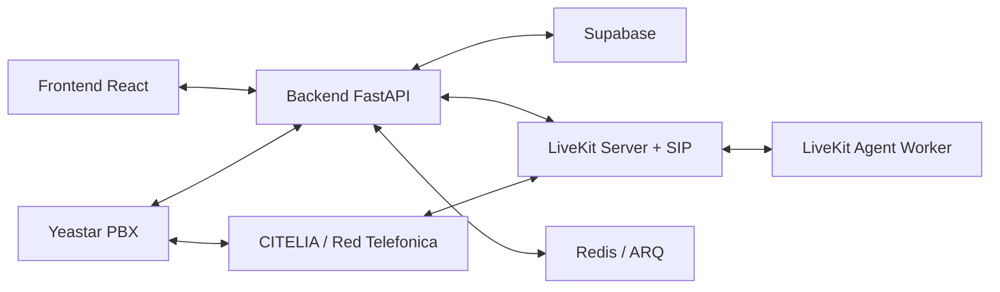
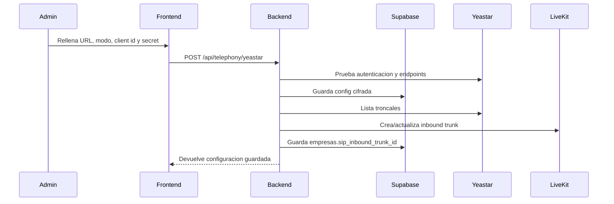
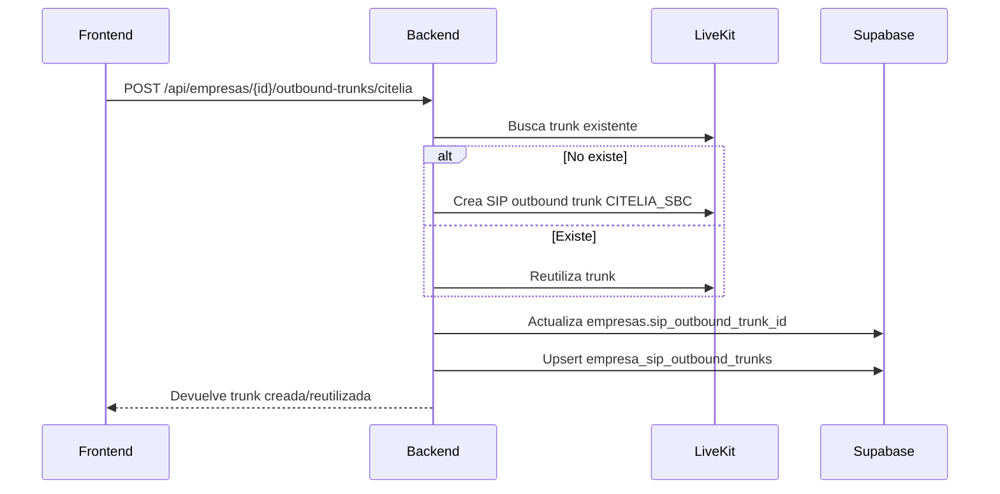
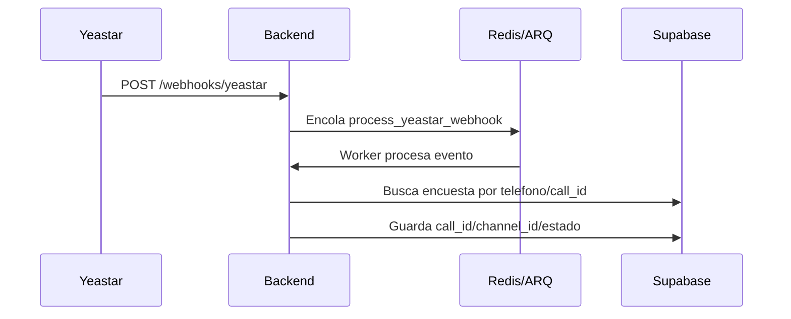
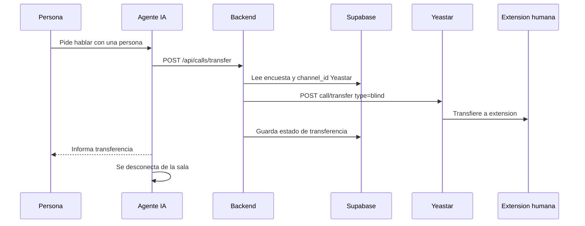
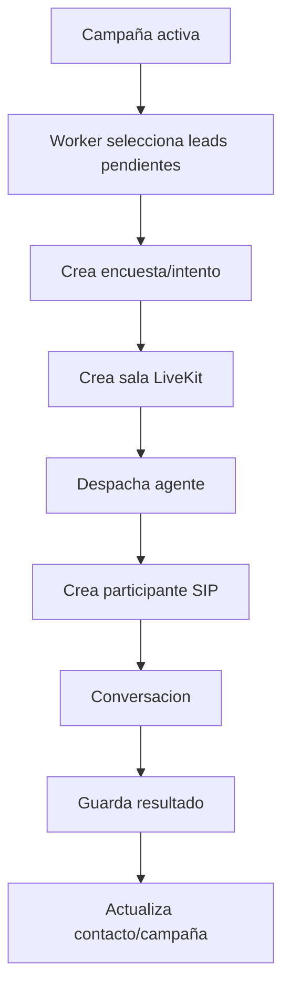

# Funcionamiento del Proyecto Ausarta Robot v2.0

Este documento resume como funciona el proyecto a nivel de producto, arquitectura y flujos. La idea central es que Ausarta Robot permite crear agentes de voz multiempresa, conectarlos a telefonia real mediante LiveKit SIP, guardar resultados en Supabase y, cuando hay integracion Yeastar, sincronizar centralitas, extensiones, troncales y transferencias a agentes humanos.

## 1. Objetivo del sistema

Ausarta Robot es una plataforma SaaS de agentes de voz. Cada empresa puede tener sus propios agentes, campañas, contactos, configuracion de telefonia e integraciones. El backend coordina llamadas salientes y entrantes, LiveKit gestiona las salas de voz y SIP, Supabase guarda la configuracion y los resultados, y Yeastar se usa como centralita externa para extensiones, estados, webhooks y transferencias.

El sistema soporta principalmente:

- Agentes de voz configurables por empresa.
- Llamadas salientes desde LiveKit usando troncales SIP.
- Llamadas entrantes desde Yeastar/CITELIA hacia LiveKit.
- Sincronizacion de extensiones y troncales Yeastar.
- Transferencia de una llamada del agente IA a una extension humana.
- Webhooks de LiveKit y Yeastar para cerrar el ciclo de estados.
- Persistencia de resultados, transcripciones, resumen y CRM/webhooks externos.

## 2. Componentes principales



### Frontend

El frontend React muestra la interfaz de administracion: agentes, campañas, telefonia, integraciones, extensiones, contactos y resultados. Desde aqui se guardan configuraciones Yeastar, se crean troncales salientes CITELIA, se prueban conexiones y se lanzan llamadas.

### Backend

El backend FastAPI es el orquestador. Sus responsabilidades principales son:

- Validar usuarios y permisos.
- Leer y escribir configuracion en Supabase.
- Crear salas LiveKit y participantes SIP.
- Crear o sincronizar troncales SIP en LiveKit.
- Consultar la API de Yeastar.
- Recibir webhooks de Yeastar y LiveKit.
- Exponer endpoints internos al agente de voz.

Archivos clave:

- `backend/api.py`: aplicacion FastAPI principal.
- `backend/routers/telephony.py`: telefonia, LiveKit, Yeastar, llamadas y webhooks.
- `backend/services/livekit_service.py`: operaciones contra LiveKit.
- `backend/services/yeastar_service.py`: cliente API Yeastar P-Series y Cloud PBX.
- `backend/services/yeastar_webhook_service.py`: normalizacion y procesado de eventos Yeastar.
- `backend/agent.py`: agente de voz LiveKit.
- `backend/worker.py`: procesos de campaña y trabajos en segundo plano.

### Supabase

Supabase es la base de datos y capa de seguridad multiempresa. Guarda empresas, usuarios, agentes, campañas, encuestas, contactos, extensiones y configuracion de telefonia.

Tablas importantes:

- `empresas`: empresa, limites, configuracion general, `sip_outbound_trunk_id`, `sip_inbound_trunk_id`.
- `user_profiles`: usuario, rol y empresa.
- `agent_config`: configuracion del agente de voz.
- `campaigns`: campañas de llamadas.
- `campaign_leads`: leads/contactos dentro de campañas.
- `encuestas`: cada llamada o intento, estado, transcripcion, resultados y metadatos.
- `contactos`: ficha consolidada del contacto por empresa.
- `company_yeastar_configs`: credenciales y capacidades de API Yeastar por empresa.
- `yeastar_extensions`: extensiones Yeastar sincronizadas o creadas por empresa.
- `empresa_sip_outbound_trunks`: troncales salientes LiveKit por empresa.
- `knowledge_base`: documentos de conocimiento para enriquecer el agente.
- `empresa_external_db`: conexion opcional a base externa por empresa.

### LiveKit

LiveKit gestiona la parte realtime:

- Salas de llamada.
- Agentes conectados a salas.
- Participantes SIP.
- Troncales SIP salientes.
- Troncales SIP entrantes.
- Dispatch rules para enviar una llamada entrante al agente correcto.

### Yeastar

Yeastar aporta integracion con centralita:

- API para leer extensiones.
- API para leer troncales.
- API para consultar estados.
- API para transferir llamadas mediante `channel_id`.
- Webhook Event Push, especialmente evento `30011 - Call State Changed`.

## 3. Seguridad y modelo multiempresa

El sistema esta pensado para que cada empresa vea y modifique solo sus propios datos. Las reglas estan en dos niveles:

- Backend: permisos mediante usuario actual, rol y `empresa_id`.
- Supabase: RLS en tablas sensibles.

Roles relevantes:

- `superadmin`: acceso global.
- Admin de Ausarta: acceso global operativo porque Ausarta es la empresa administradora.
- Admin de empresa: acceso a su propia empresa.
- Usuario normal: acceso limitado a su contexto.

La configuracion de troncales salientes CITELIA esta restringida a `superadmin` o admin de Ausarta.

## 4. Configuracion Yeastar

Desde la interfaz se guarda una configuracion por empresa en `company_yeastar_configs`.

Campos relevantes:

- `empresa_id`
- `api_url`
- `api_port`
- `api_mode`: `pseries` o `cloud_pbx`
- `client_id`
- `client_secret_encrypted`
- `enabled_capabilities`
- `is_active`

Flujo de guardado:



Al guardar Yeastar, el backend intenta tambien crear o actualizar una troncal entrante en LiveKit usando la informacion de la troncal Yeastar. Esto evita tener que crear la inbound manualmente.

## 5. Troncales salientes CITELIA

La troncal saliente se crea desde la interfaz por empresa. El unico dato manual es el DDI.

Plantilla fija CITELIA:

- Host/address: `212.63.112.35:38932`
- Transport: `UDP`
- Domain/from_host: `212.63.112.35`
- Numero: DDI de la empresa

Flujo:



## 6. Troncales entrantes Yeastar hacia LiveKit

Cuando la API Yeastar esta configurada, el backend puede generar automaticamente la inbound de LiveKit.

Nombre de la trunk:

- `YEASTAR_INBOUND_{empresa_id}`

Nombre de la regla de dispatch:

- `YEASTAR_DISPATCH_{empresa_id}`

La sincronizacion obtiene:

- IP o host de la troncal Yeastar.
- IP resuelta del dominio PBX.
- DDI detectado desde Yeastar.
- DDI guardado en `empresa_sip_outbound_trunks`.

Luego crea o actualiza en LiveKit:

- `numbers`: numeros/DDI aceptados.
- `allowed_addresses`: IPs permitidas.
- `room_prefix`: `yeastar_{empresa_id}_`
- agente dispatch: `AGENT_NAME_DISPATCH` o `default_agent`.

Endpoint manual:

```http
POST /api/empresas/{empresa_id}/inbound-trunks/sync-yeastar
```

Importante: crear la inbound en LiveKit no obliga a Yeastar o CITELIA a enviar llamadas alli. La red telefonica debe enrutar la llamada al servidor SIP de LiveKit/Kamailio, por ejemplo `15.216.15.30:5060`.

## 7. Llamada saliente

Una llamada saliente nace desde una campaña, un lead o una accion manual del usuario.

```mermaid
sequenceDiagram
    participant UI as Frontend
    participant API as Backend
    participant DB as Supabase
    participant LK as LiveKit
    participant AG as Agente
    participant SIP as Red SIP
    participant P as Persona llamada

    UI->>API: POST /api/calls/outbound
    API->>DB: Crea/actualiza encuesta
    API->>LK: Crea sala con metadata
    API->>LK: Dispatch del agente
    LK->>AG: Arranca worker en la sala
    API->>LK: Crea participante SIP saliente
    LK->>SIP: Sale por trunk SIP
    SIP->>P: Suena el telefono
    P-->>LK: Contesta
    AG<->>P: Conversacion de voz
    AG->>API: Guarda resultado o pide transferencia
    API->>DB: Persiste estado y datos
```

Detalles importantes:

- La sala incluye metadata como `empresa_id`, `campana_id`, `contacto_id` y `survey_id`.
- El agente lee su configuracion desde `agent_config`.
- La troncal saliente se resuelve desde `empresas.sip_outbound_trunk_id` o tablas de troncales.
- El backend espera a que el agente este listo antes de conectar el SIP para reducir llamadas mudas.

## 8. Llamada entrante

Una llamada entrante empieza fuera de la aplicacion: alguien llama al numero publico, CITELIA/Yeastar lo enruta y LiveKit recibe el SIP.

```mermaid
sequenceDiagram
    participant P as Persona llamante
    participant SIP as CITELIA/Yeastar
    participant LK as LiveKit SIP
    participant AG as Agente
    participant API as Backend
    participant DB as Supabase

    P->>SIP: Llama al DDI
    SIP->>LK: INVITE SIP a LiveKit/Kamailio
    LK->>LK: Valida numbers y allowed_addresses
    LK->>AG: Dispatch rule crea sala y agente
    AG->>API: Pide configuracion por survey/metadata si aplica
    AG<->>P: Conversacion
    AG->>API: Guarda resultado
    API->>DB: Actualiza encuesta/contacto
```

Para que funcione:

- LiveKit debe tener inbound trunk creada.
- Yeastar/CITELIA debe enviar la llamada al host SIP correcto.
- El worker de agente debe estar ejecutandose.
- Los puertos SIP/RTP deben estar abiertos.

## 9. Webhooks Yeastar

Yeastar envia eventos al backend en:

```http
POST /webhooks/yeastar
```

El evento recomendado es:

- `30011 - Call State Changed`

Este evento es importante porque trae identificadores de llamada, incluido el `channel_id`, que luego se usa para transferir llamadas a una extension humana.

Flujo:



## 10. Transferencia a agente humano

El agente IA tiene una herramienta llamada `transferir_a_agente_humano`. Cuando decide transferir:

1. Resuelve la extension destino.
2. Puede crear un briefing para el agente humano.
3. Llama al backend.
4. El backend usa Yeastar API para hacer una transferencia blind.
5. El agente IA se desconecta de forma limpia y la llamada queda con el humano.



Requisitos para transferir:

- Yeastar API activa.
- Capacidad `calls.control` habilitada.
- Webhook `30011` funcionando.
- `yeastar_channel_id` guardado en la encuesta.
- Extension humana existente en `yeastar_extensions` o indicada manualmente.

## 11. Webhooks LiveKit

LiveKit envia eventos al backend en:

```http
POST /api/livekit/webhook
```

El backend valida la firma del webhook y usa eventos como `room_finished` o `participant_left` para actualizar estados de llamadas, cerrar encuestas pendientes y lanzar analisis posteriores.

## 12. Persistencia de resultados

Durante y despues de una llamada, el sistema guarda informacion en Supabase:

- Estado de llamada.
- Transcripcion.
- Resultado del agente.
- Disposicion final.
- Resumen de llamada.
- Datos extraidos por el esquema del agente.
- Telefono, contacto, campaña y empresa.
- Briefing si hubo transferencia.

El agente puede llamar endpoints internos como:

- `POST /guardar-encuesta`
- `POST /colgar`
- `POST /api/calls/transfer`

## 13. Campañas y automatizacion

El worker de campañas toma leads pendientes, respeta limites de empresa y agenda, crea registros de llamada y dispara llamadas salientes.



## 14. Configuracion externa necesaria

Para que el proyecto funcione en despliegue real:

- Backend accesible publicamente para webhooks.
- Frontend apuntando al backend correcto.
- LiveKit con `LIVEKIT_URL`, `LIVEKIT_API_KEY`, `LIVEKIT_API_SECRET`.
- Worker `backend/agent.py` ejecutandose.
- Redis disponible para cache y trabajos.
- Supabase con migraciones aplicadas.
- Yeastar API habilitada y con IP permitida.
- Yeastar Event Push apuntando a `/webhooks/yeastar`.
- Troncales SIP y rutas de entrada/salida correctamente configuradas.
- Puertos SIP/RTP abiertos en servidor y firewall.

## 15. Endpoints operativos clave

Telefonia y Yeastar:

- `GET /api/telephony/platform-info`
- `GET /api/telephony/yeastar/capabilities`
- `GET /api/telephony/trunks`
- `POST /api/empresas/{empresa_id}/outbound-trunks/citelia`
- `POST /api/empresas/{empresa_id}/inbound-trunks/sync-yeastar`
- `GET /api/telephony/yeastar`
- `POST /api/telephony/yeastar`
- `POST /api/telephony/yeastar/test`
- `POST /webhooks/yeastar`

Llamadas:

- `POST /api/calls/outbound`
- `POST /api/calls/transfer`
- `POST /api/telephony/transfer`
- `POST /api/calls/hang_up`
- `POST /api/telephony/test-outbound`

Extensiones:

- `GET /api/empresas/{empresa_id}/extensions`
- `POST /api/empresas/{empresa_id}/extensions/sync`
- `GET /api/empresas/{empresa_id}/extensions/statuses`
- `POST /api/empresas/{empresa_id}/extensions`
- `PUT /api/empresas/{empresa_id}/extensions/{ext_id}`
- `DELETE /api/empresas/{empresa_id}/extensions/{ext_id}`

Agente y resultados:

- `POST /guardar-encuesta`
- `POST /colgar`
- `POST /api/livekit/webhook`

## 16. Flujo completo recomendado de puesta en marcha

1. Crear empresa y usuarios en Supabase.
2. Configurar LiveKit en variables de entorno.
3. Arrancar backend, Redis, worker ARQ y agente LiveKit.
4. En la interfaz, guardar API Yeastar.
5. Probar conexion Yeastar.
6. Sincronizar extensiones Yeastar.
7. Crear troncal saliente CITELIA con el DDI de la empresa.
8. Guardar Yeastar para generar o actualizar inbound LiveKit.
9. Configurar Yeastar/CITELIA para enrutar llamadas entrantes al SIP de LiveKit.
10. Lanzar llamada saliente de prueba.
11. Hacer llamada entrante de prueba.
12. Probar transferencia a extension humana.
13. Revisar `encuestas`, `contactos`, logs backend, logs agente y webhooks.

## 17. Limitaciones y puntos a vigilar

- La inbound LiveKit puede crearse sola, pero el enrutamiento SIP externo debe existir en Yeastar/CITELIA.
- La transferencia necesita `channel_id`; sin webhook `30011` no se puede transferir de forma fiable.
- Si cambia la IP publica de Yeastar o del origen SIP, hay que resincronizar la inbound para actualizar `allowed_addresses`.
- Si el agente LiveKit no esta arrancado, la sala puede crearse pero nadie contestara.
- Si el backend no es publico, Yeastar y LiveKit no podran enviar webhooks.
- Los tokens Yeastar se cachean; si hay errores de token expirado, el backend fuerza refresh.

## 18. Resumen corto

El frontend configura empresas, agentes y telefonia. El backend guarda todo en Supabase y habla con LiveKit y Yeastar. LiveKit pone la voz, las salas y las troncales SIP. Yeastar aporta centralita, extensiones, eventos y transferencia. Las llamadas salientes salen por una trunk LiveKit; las entrantes llegan a LiveKit desde Yeastar/CITELIA; y el agente puede guardar resultados o transferir la llamada a una persona real.
